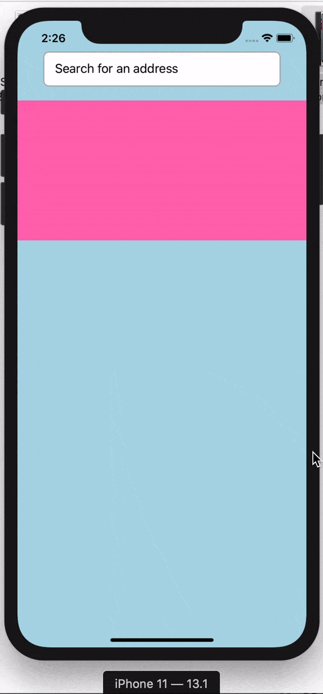

# Google autocomplete example

Hi there, this is the repo for the [Google-auto-complete](https://dev.to/mosoakinyemi/how-to-create-a-google-autocomplete-form-in-react-native-4ffb) blog post



## Getting Started

1. [Fork repository](https://github.com/mosoakinyemu/autocomplete-example.git/fork) and clone it locally

```
$ git clone https://github.com/mosoakinyemi/autocomplete-example.git
$ cd newsdemo
$ yarn install
```

### Run on Android

```
$ npx react-native run-android
```

### Run on iOS

```
$ cd ios && pod install
$ cd .. && npx react-native run-ios
```
